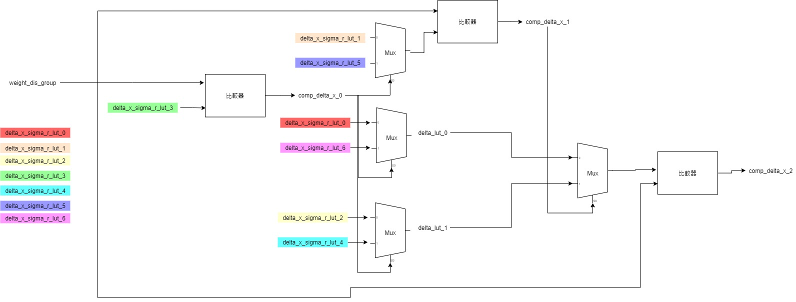
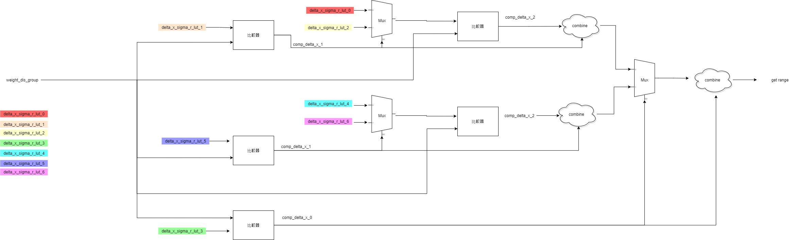

# I. 每日金句
Error generating random picture <br>
> Trying to define yourself is like trying to bite your own teeth.
> — <cite>Alan Watts</cite>

>中文翻譯:
>试图定义自己就像试图咬自己的牙齿。
---

# II. 回顧
```note-brown
開啟回顧，回想昨天以及去年的今天發生了什麼
```

## 明天
[[2022-09-15 daily note]]

## 一年前的今天
[[2021/09/2021-09-14 daily note]]

## 昨天
[[2022-09-13 daily note]] 


---
# III. 每日活動
今天是週三
```ActivityHistory
/

```

---
# IV. 每日感恩日記
## 早晨紀錄
### 精華
```note-brown
今天的人生精華是甚麼?
```
```note-red
要注意是否有精力完成
```
- 今天我忘了要拉筋了
- 今天早上沒紀錄?

### 目標確立
```note-brown
你想成為甚麼樣的人?
```
- 我想成為身體健康的人

### News 新聞
```note-brown
今天發生了什麼重大的事情、看到了甚麼新聞?有甚麼感想?
```
- 沒有

## 晚間紀錄
### 文章
```note-brown
每天至少閱讀1篇文章，並作筆記
```

```note-blue
生產力、知識型文章
```
- 可以把一般知識化為文章
- 何謂痛風?[比起痛風鍋，天天喝手搖杯更容易讓人痛風？](https://www.youtube.com/watch?v=7p_oVeTcL9Q&t=1s)

### 心靈
```note-brown
今天有哪 3 件值得感恩的事情?
```
- 感謝醫生告訴我我手的筋膜有點鬆
- 感謝晚餐店老闆提供好吃的晚餐給我
- 感謝今天的腳好像有好點了

### 弱連結
```note-brown
今天是否「日行一善」，幫助了任何人?
```
- 沒有

### 親密關係
```note-brown
今天要如何和另一半/家人/朋友表達關心、互動? 或是學習關於兩性之間的知識?
```
- 沒有

### 健康 (如何吃? 如何動? 如何靜?)
```note-brown
我做了哪些事情讓自己休息及放鬆? 做了甚麼運動?
```
- 沒有，應該要拉筋的

### 財務
```note-brown
今天購買了哪些東西 ?
```
- 晚餐
- 看病150

### 生活產出
```note-brown
本日 AAR (After Action Review)
```

#### 1. 今天完成了什麼事情？ 
- 完成ABF驗證
- 開始閱讀log 硬體化的設計

#### 2. 選一件讓我有感覺、有啟發的事情 
- [时序分析基本概念介绍&lt;wire load model&gt;_lib](https://www.sohu.com/a/309503421_99933533)
- [https://bbs.elecfans.com/jishu_1589084_1_1.html](https://bbs.elecfans.com/jishu_1589084_1_1.html)

#### 3. 我從過程中學習到什麼事情 ? 
- coding時要思考，有那些部分是可以用空間換取時間，或是時間換取空間的，以下是pipe line 的比較器架構，timing 較緊但是面積較小，用到的比較器比較少

另一種架構是用比較多的空間，但是換來比較好的timing


#### 4. 下次要如何做可以更好/有可以更好的地方嗎？
- 沒有

### 今天生活中發生的事或是感想
```note-brown
紀錄生活以及身邊發生的小事
```
- 今天去看醫生，醫生說我的手有點鬆馳，我想打PRP了
- 摸索完powertoys 了，功能真的很讚

### 發覺優點及缺點
```note-brown
紀錄生活中所見之人的優點及缺點
```
優點 : 
- 沒有

缺點 : 
- 沒有

### 改變(加入到notion人生原則中)
```note-brown
我可以做什麼改變讓自己變得更好?或是看到其他人有甚麼好或不好的行為可以學習的?
```
- [x] 沒有 ✅ 2022-09-14

### 領悟(加入到notion人生原則中)
```note-brown
我從生活中得到的領悟?
```
- [x] 沒有 ✅ 2022-09-14

### 新學習
```note-brown
今天有沒有從生活中學到甚麼新的事物、技能?
```
- 沒有

### Ideas
```note-brown
把腦中靈感、想法都放在這個區域
```
- 台南風帆基地好像不錯玩

### 夢想
```note-brown
我為我的個人目標做了什麼?
```
- 沒有

### 每日檢查清單
- [x] 清除每日蒐集 ✅ 2022-09-14
- [x] 檢視待處理的事項 ✅ 2022-09-14
 
### 回顧紀錄

以上為空則不用建立任何項目


###  
```
 
```

###  
#### 
```

```
#### 
```

```

#### 

```
2022-09-14
```

