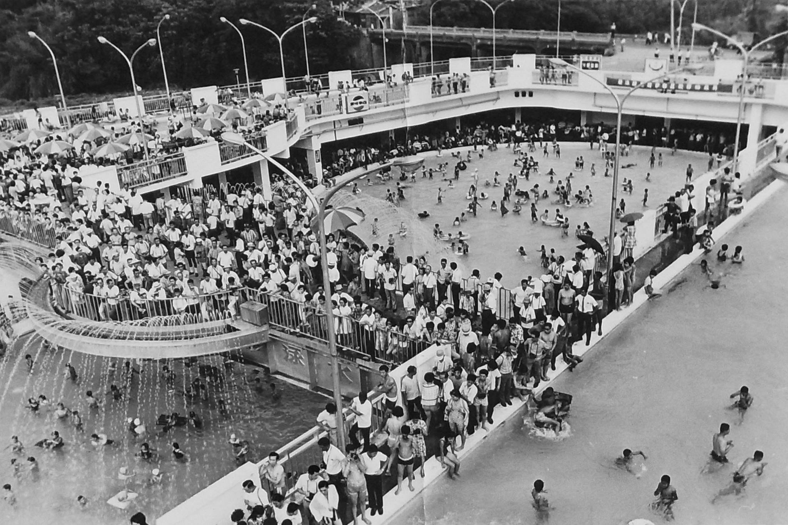

# I. 每日金句
 

---

# II. 回顧
```note-brown
開啟回顧，回想昨天以及去年的今天發生了什麼
```

## 明天
[[2022-09-23 daily note]]

## 一年前的今天
[[2021/09/2021-09-22 daily note]]

## 昨天
[[2022-09-21 daily note]] 


---
# III. 每日活動
今天是週四
```ActivityHistory
/

```

---
# IV. 每日感恩日記
## 早晨紀錄
### 精華
```note-brown
今天的人生精華是甚麼?
```
```note-red
要注意是否有精力完成
```
- 去游泳
- 看完學習如何學習

### 目標確立
```note-brown
你想成為甚麼樣的人?
```
- 我想成為有規劃的人

### News 新聞
```note-brown
今天發生了什麼重大的事情、看到了甚麼新聞?有甚麼感想?
```
- [垃圾代收新創Tracle完成550萬元募資，每月370元再也不用追垃圾車 | Meet創業小聚](https://meet.bnext.com.tw/articles/view/49507)
- [普丁徵召30萬後備軍人 俄離境班機票價飆漲 ｜ 公視新聞網 PNN](https://news.pts.org.tw/article/601040)
- [真的可以出國了！蘇貞昌：入境「0+7」預計10月13日上路 | 中央社 | 遠見雜誌](https://www.gvm.com.tw/article/94447)

## 晚間紀錄
### 文章
```note-brown
每天至少閱讀1篇文章，並作筆記
```

```note-blue
兩性、感性類文章
```
- 沒有
- 我有經很久沒有閱讀文章了，我認為我應該要針對這問題好好思考一下該如何解決

### 心靈
```note-brown
今天有哪 3 件值得感恩的事情?
```
- 感謝便當店老闆給我好吃的雞絲麵
- 感謝[@humphrey](@humphrey.md)又教導了我一些關於如何教調高精確度的解決方法
- 感謝我今天又投資我自己成為一個更好的人

### 弱連結
```note-brown
今天是否「日行一善」，幫助了任何人?
```
- 沒有

### 親密關係
```note-brown
今天要如何和另一半/家人/朋友表達關心、互動? 或是學習關於兩性之間的知識?
```
- 沒有

### 健康 (如何吃? 如何動? 如何靜?)
```note-brown
我做了哪些事情讓自己休息及放鬆? 做了甚麼運動?
```
- 拉筋+肌力訓練 40 分鐘
- 今天時間抓得還挺好的

### 財務
```note-brown
今天購買了哪些東西 ?
```
- 便當

### 生活產出
```note-brown
本日 AAR (After Action Review)
```

#### 1. 今天完成了什麼事情？ 
- 用excel完成了對paper 中算式的重現，確定paper 中的用法是可行的

#### 2. 選一件讓我有感覺、有啟發的事情 
- 沒有

#### 3. 我從過程中學習到什麼事情 ? 
- 學習如何透過一些方法提高趨近法的準確度

#### 4. 下次要如何做可以更好/有可以更好的地方嗎？
- 我要把這些方法記錄下來

### 今天生活中發生的事或是感想
```note-brown
紀錄生活以及身邊發生的小事
```
- 我發現我的筆電居然裂開了

### 發覺優點及缺點
```note-brown
紀錄生活中所見之人的優點及缺點
```
優點 : 
- 沒有

缺點 : 
- 沒有

### 改變(加入到notion人生原則中)
```note-brown
我可以做什麼改變讓自己變得更好?或是看到其他人有甚麼好或不好的行為可以學習的?
```
- [x] 沒有 ✅ 2022-09-22

### 領悟(加入到notion人生原則中)
```note-brown
我從生活中得到的領悟?
```
- [x] 沒有 ✅ 2022-09-22

### 新學習
```note-brown
今天有沒有從生活中學到甚麼新的事物、技能?
```
- 沒有

### Ideas
```note-brown
把腦中靈感、想法都放在這個區域
```
- 回去找了清潭游泳池的歷史，感覺真的蠻有趣的



- 終於搞定google calendar 了，現在時間到會跳通知了 
- 我要把更多的想法隨時記錄下來
- 今天去拿輸了好高興，我居然訂了10本書
- 找時間觀看google calendar 是麼做的
- 學習更多zotero相關插件

### 夢想
```note-brown
我為我的個人目標做了什麼?
```
- 閱讀學習如何學習

### 每日檢查清單
- [x] 清除每日蒐集 ✅ 2022-09-22
- [x] 檢視待處理的事項 ✅ 2022-09-22
 
### 回顧紀錄

以上為空則不用建立任何項目


###  
```
 
```

###  
#### 
```

```
#### 
```

```

#### 

```
2022-09-22
```

